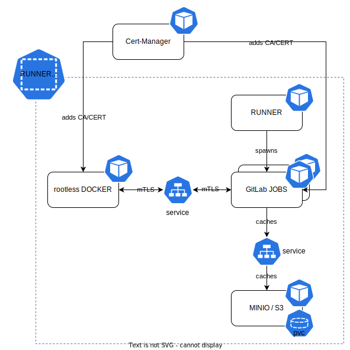

# Secure Remote Docker-in-Docker

A HelmChart to provide a secure rootless remote dind service for other deployments.

## What to expect / How to use it?

The following example demonstrates how a [`gitlab-runner`](https://gitlab.com/gitlab-org/gitlab-runner) can access the `secure-remote-dind` service via mTLS certificate authorization which is provided by the [`cert-manager`]([https://c](https://cert-manager.io/)) [`CSI Driver`](https://cert-manager.io/docs/usage/csi/). Furthermore the [`gitlab-runner-jobs`](https://gitlab.com/gitlab-org/gitlab-runner) are configured to use [`minio-s3`](https://min.io/) as cache.

See the [examples directory](/examples/access-dind.md) for the demo deployment.

## Motivation

We needed to have rootless docker-in-docker support for our CI/CD pipelines without giving privileged access to the runner pods.

## Future Work

- Create a ClusterIssuer with a CertificateRequestPolicy to allow multiple namespaces to authorize against the dind service.
- Remove PSPs.
- Metrics export for the dind service.
- Health endpoint for the dind service.
